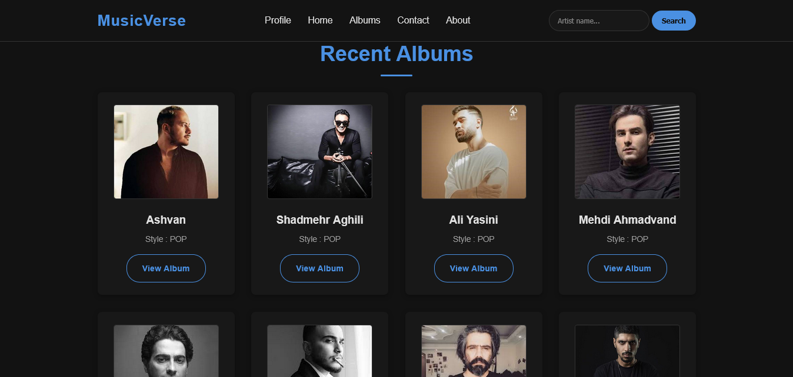

<section style="max-width:700px; margin:auto; font-family:Arial, sans-serif; line-height:1.7; color:#333;">
  <h1 style="text-align:center; color:#2c3e50;">Django Music Player</h1>

  <p align="center">
  
  </p>
</section>

<h2>About</h2>
<p>A music player website for listening to and downloading music.
Users can also add their favorite songs to their favorites list.</p>


<h2>Features</h2>
<ul>
  <li>Session Authentication</li>
  <li>User Profile</li>
  <li>Password Reset with OTP</li>
  <li>Caching</li>
  <li>Music Search</li>
  <li>Favorite Music</li>
  <li>Music Download</li>
</ul>


<h2>Technologies</h2>
<ul>
  <li>Python</li>
  <li>Django</li>
  <li>PostgreSQL</li>
  <li>Redis</li>
  <li>Google OAuth</li>
  <li>HTML, CSS, JavaScript</li>
</ul>

<h2>⚙️ Installation (Windows)</h2>

<p>Follow these steps to set up and run the project locally.</p>

<hr>

<h3>1. Clone the repository</h3>

```bash
git clone https://github.com/mhmdheydarii/Django-Music-Player.git
```

<br>

<h3>2. Navigate to the project directory</h3>

```bash
cd Django_Music_Player
```

<br>

<h3>3. Configure environment variables</h3>

<p>Create a .env file in the project root and add the required environment variables.</p>

```bash
SECRET_KEY=your-secret-key
DEBUG=True
ALLOWED_HOSTS="*"

DB
NAME=db-name
USER=db-user
PASSWORD-db-password
HOST=db-hose
PORT=db-port

SMTP
EMAIL_USER=your email address
EMAIL_PASSWORD=your email password
```
</br>

<h3>4. Run the project</h3>

```bash
docker compose up --build
```
<br>
<h3>4. Migrations </h3>

```bash
docker compose exec backend python manage.py migrate
```

</details>

<br>

<p align="center">
⭐ If you found this project useful, consider giving it a star.
</p>
